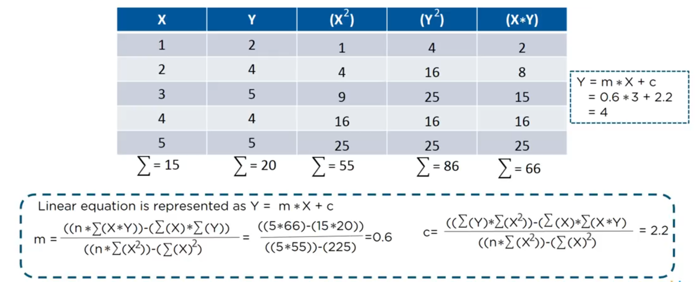
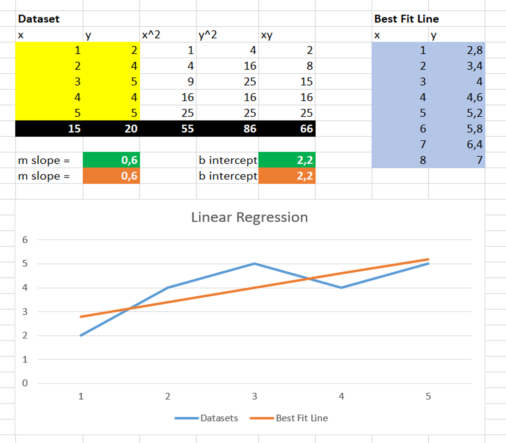
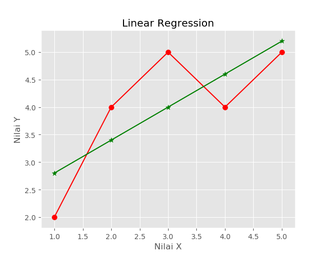
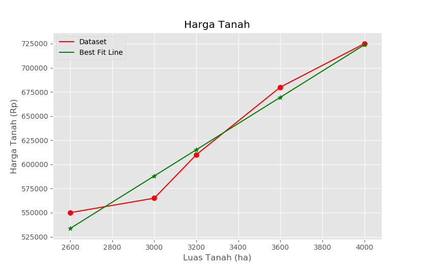

# Sklearn: Linear Regression

### **Basic Formula**

In statistics, __linear regression__ is a linear approach to modelling the relationship between a scalar response (or dependent variable) and one or more explanatory variables (or independent variables). Here is the basic formula of linear regression, especially on how to solve the value of _**m** (slope)_ & _**b** (intercept)_ of the **best fit line**:



#

### **Using Microsoft Excel**

Here is the example of linear regression using Microsoft Excel. Clone/download this repo & open file: __*0_basic_regression.xlsx*__:



#

### **Using Sklearn on Python**

Clone/download this repo, open & run python script: __*2_plot_bestFitLine.py*__. It will create a plot figure of dataset with its best fit line. Make sure you have installed __*pandas*__, __*numpy*__, __*matplotlib*__ & __*sklearn*__ packages!

```python

import pandas as pd
import numpy as np
import matplotlib.pyplot as plt
plt.style.use('ggplot')

# ================================
# create dataframe

x = np.array([1, 2, 3, 4, 5])
y = np.array([2, 4, 5, 4, 5])
df = pd.DataFrame({
    'x': x,
    'y': y
})
print(df)

# ================================
# linear regression

from sklearn import linear_model
model = linear_model.LinearRegression()

# training w/ dataset: mode.fit(dataIndependent[2D], dataDependent[1D])
model.fit(df[['x']], df['y'])

# show m(gradient/slope) & b(intercept) of 'best fit line'
print('Slope = ', model.coef_)
print('Intercept = ', model.intercept_)

# prediction
print(model.predict([[8]]))

# ================================

# plot dataframe
plt.plot(df['x'], df['y'], 'r-')

# plot best fit line
plt.plot(df['x'], model.predict(df[['x']]), 'g-')

# scatter dataframe
plt.scatter(df['x'], df['y'], color='r', marker='o', s=50)

# scatter best fit line
plt.scatter(df['x'], model.predict(df[['x']]), color='g', marker='o', s=50)

plt.xlabel('Nilai X')
plt.ylabel('Nilai Y')
plt.title('Linear Regression')
plt.legend(['Dataset', 'Best Fit Line'])
plt.show()

```



#

### **Case Example**

Provided a __csv__ file contains a dataset about land size & its price (open *3_hargaTanah.csv*). Run *3_hargaTanah.py* and it will create the prediction of land price based on its size. Here is the graph:



#

#### Lintang Wisesa :love_letter: _lintangwisesa@ymail.com_

[Facebook](https://www.facebook.com/lintangbagus) | 
[Twitter](https://twitter.com/Lintang_Wisesa) |
[Google+](https://plus.google.com/u/0/+LintangWisesa1) |
[Youtube](https://www.youtube.com/user/lintangbagus) | 
:octocat: [GitHub](https://github.com/LintangWisesa) |
[Hackster](https://www.hackster.io/lintangwisesa)